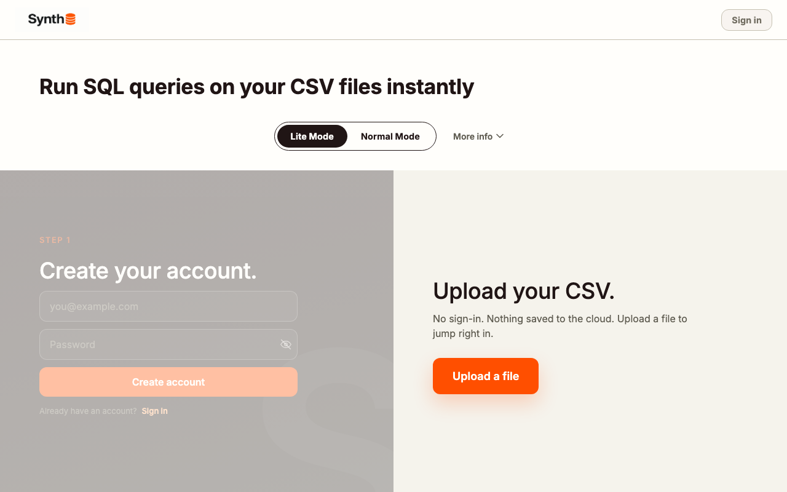
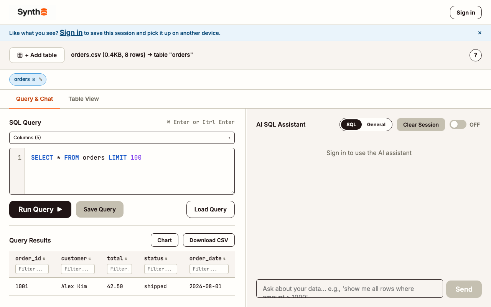

# Synth

Query any CSV or JSON file with real SQL, or in plain English, entirely in your browser. No database to install, no server to host. Upload a file and it becomes a live SQLite database running client-side in your browser tab.

**Live app:** [synth-sql.com](https://www.synth-sql.com/)



## Features

- **Real SQL, not a formula language:** runs an actual SQLite database (compiled to WebAssembly via [sql.js](https://github.com/sql-js/sql.js)), so you get real `JOIN`s, `GROUP BY`, window functions, and subqueries against your file
- **CSV and JSON:** a plain CSV, a JSON array of objects, or newline-delimited JSON (NDJSON); nested JSON objects flatten into dot-notation columns, arrays store as JSON text queryable with SQLite's own `json_extract()`
- **AI assistant, two modes:** SQL Mode returns a runnable query, General Mode answers in plain English; only your table's schema (column names, types, row count) is ever sent to generate a response, never your actual data
- **No account required to start:** Lite Mode loads and queries a file with zero sign-in, entirely in-memory; signing in (Normal Mode) adds cross-device sync for workspaces and chat sessions
- **Multi-table workspaces:** up to 10 tables in one workspace, with relationship detection that auto-suggests foreign keys between tables and CSVs up to 500,000 rows
- **Runs entirely client-side:** your file is never uploaded anywhere unless you explicitly sign in and choose to save it to the cloud



## How it works

- **Query engine:** [sql.js](https://github.com/sql-js/sql.js) (SQLite compiled to WebAssembly), running entirely in the browser with no server round-trip for query execution
- **AI assistant:** served through a Vercel serverless function (`api/chat.js`) that proxies to Groq, so the API key is never exposed to the browser
- **Auth & storage:** [Supabase](https://supabase.com/) (Postgres + Auth + Storage) for the optional signed-in tier, covering workspaces and saved chat sessions
- **No build step:** the app itself (`synth.html`) is a single static HTML file with inline CSS/JS; no bundler, no framework

## Local development

**Prerequisites:** Node.js, and the [Vercel CLI](https://vercel.com/docs/cli) (`npm i -g vercel`) since the API routes under `api/` are Vercel serverless functions.

```bash
git clone https://github.com/spelillo/synth.git
cd synth
npm install
vercel dev
```

`vercel dev` serves `synth.html` and the `api/` functions together, matching production.

### Environment variables

The API routes read these from your environment (create a `.env.local`, which is gitignored):

| Variable | Used for |
|---|---|
| `SUPABASE_URL` | Server-side Supabase client (admin operations) |
| `SUPABASE_SERVICE_ROLE_KEY` | Bypasses RLS for admin routes; never expose this to the client |
| `GROQ_API_KEY` | Powers the AI assistant (`api/chat.js`) |
| `CRON_SECRET` | Authenticates scheduled Vercel Cron jobs |

The client-side Supabase URL/anon key is hardcoded directly in `synth.html` rather than pulled from an env var, since there's no bundler here to inject it at build time. It's meant to be public. Point it at your own Supabase project for local development.

## Tech stack

SQLite (via WebAssembly) &middot; Supabase &middot; Groq &middot; Vercel Serverless Functions &middot; vanilla JS/HTML/CSS (no framework, no bundler)

## License

There's no `LICENSE` file, so standard copyright applies: the code isn't licensed for reuse, modification, or redistribution.
